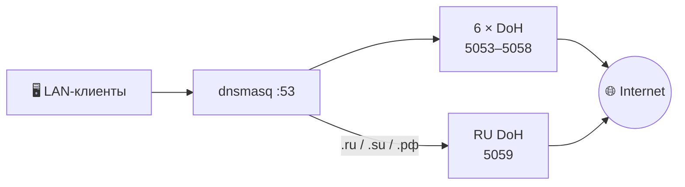

<h1 align="center"> 🚀 DNS Manager — Hybrid DoH для OpenWrt</h1>

> Скрипт настраивает DNS на OpenWrt: читает реальное состояние роутера, вживую тестирует каталог DoH, показывает план и применяет изменения только после подтверждения. Не прошла проверка — откатывает свою транзакцию.

<div align="center">


</div>

## 🧠 Как это устроено



Обычные домены идут параллельно в шесть локальных DoH-инстансов (`allservers=1`, берётся первый успешный ответ). Российские зоны можно увести в отдельный RU-сервер, чтобы не смешивать их с общим пулом.

Каждый слот запоминает свою **категорию** (`SLOT_x_CAT` в `manager.conf`): `bypass`, `clean`, `security`, `privacy`, `adblock`, `family`, `social`, `regional`. По ней Watchdog подбирает замены и возвращает слоты в выбранный профиль.

## ⚡ Установка и запуск

```
wget -O /usr/bin/dns-manager https://raw.githubusercontent.com/PoTuStoronu222/DNS-Manager/main/dns-manager.sh
chmod +x /usr/bin/dns-manager
dns-manager
```

После установки менеджер запускается и обновляеться одной командой:

```
dns-manager
```


## 📦 Требования

| Компонент | Зачем нужен |
| --- | --- |
| dnsmasq | локальная DNS-точка для клиентов |
| https-dns-proxy | локальные DoH-инстансы |
| curl | HTTPS/DoH-проверки |
| dig (`bind-dig` / `bind-tools`) | диагностика и проверки |
| ca-certificates / ca-bundle | проверка TLS-сертификатов |

📦 Если чего-то не хватает — менеджер покажет список и после подтверждения поставит недостающее через `opkg` или `apk` (пункт `15`).

## 🚀 Быстрая настройка

1. Запусти `dns-manager`.
2. Нажми `[1] 🚀 МАКСИМАЛЬНЫЙ ГИБРИДНЫЙ ОБХОД`.
3. Дождись теста каталога (параллельно, может занять несколько минут).
4. Проверь план и нажми ✓ ДА.

Что делает пункт `1`:

- тестирует весь каталог DoH;
- ⚡ выбирает до 6 доступных серверов из категории обхода, без дублей;
- 🇷🇺 ставит Yandex RU для `.ru / .su / .рф`;
- ⚖️ включает параллельный опрос `allservers=1`;
- 🧱 применяет основной DNS-контур.
- ✅ проверяет результат после применения.

## 🧭 Главное меню

```
[1]  🚀 Максимальный гибридный обход
[2]  ⚡ Максимальная скорость
[3]  🛡 Максимальная безопасность
[4]  🔐 Максимальная приватность
[5]  🧹 Блокировка рекламы
[6]  ⭐ Выбор по категориям
[7]  📊 Карта состояния
[8]  🔍 Тест всех DNS/DoH
[9]  ⚙ Слоты DNS (6+2)
[10] 🎯 Bootstrap DNS
[11] 🕐 Время / NTP
[12] 🔧 Дополнительные настройки
[13] 📋 Состояние и журнал
[14] ⚡ Показать и применить выбранное
[15] 📦 Установить недостающее
[16] 🔄 Удалить только изменения DNS Manager
[Enter] 🚪 Выход
```

## 🧿 Категории и профили

| Пункт меню | Категория | Что означает |
| --- | --- | --- |
| `[1]` Максимальный гибридный обход | `bypass` | обход региональных блокировок, geo-сервисы |
| `[2]` Максимальная скорость | `clean` | чистые публичные DNS, минимальное время ответа |
| `[3]` Максимальная безопасность | `security` | фильтрация malware / phishing |
| `[4]` Максимальная приватность | `privacy` | без логов, QNAME-минимизация |
| `[5]` Блокировка рекламы | `adblock` | реклама и трекеры |
| `[6]` Выбор по категориям | любая | `family`, `social`, `bypass`, `clean`, … или микс «Все категории» |

Выбранная категория записывается в каждый слот. Ручной выбор в пункте `9` тоже сохраняет категорию; `99` очищает слот вместе с категорией.

## 🐕 Watchdog — автопроверка DoH

Включение:

- в меню: `12` → `11`, интервал 1–59 минут (по умолчанию 15);

Алгоритм проверки:

1. Каждый выбранный DoH проверяется вживую (реальный RFC 8484-запрос). При сбое — повторная проверка через 5 секунд, чтобы не менять сервер из-за единичного глюка.
2. Сервер мёртв → до **3 попыток** замены: сначала из целевой категории слота, если кандидатов нет — резерв из `clean` (список «Максимальная скорость»). Каждый кандидат перед применением проверяется вживую.
3. Слот временно стоит в резерве, а целевая категория снова доступна → Watchdog **возвращает слот в профиль** (один возврат за цикл), причём только в сервер своей категории.
4. Любая замена идёт через обычный путь применения: снимок → применение → проверка → 🩷 откат при ошибке.
5. Полный перетест каталога — если результаты старше 1 часа.

Watchdog работает только на выбранных из стоковых профилей. если что то менялось вручную автоматика не сработает. Все события пишутся в `/var/log/dns-manager.log`.


## 🔌 Порты

```
5053–5058 — шесть общих DoH
5059      — RU-сервер для .ru / .su / .рф
```

Если стандартный порт занят чужим сервисом — менеджер его не отнимает, а подбирает свободный из диапазона 5053–5099. Дубли портов в плане исключаются, итог показывается после применения.

## 🔍 Тест DNS

Проверяется реальный DoH-ответ (RFC 8484):

- 🎯 разрешение имени через bootstrap;
- 🔐 HTTPS/TLS-соединение;
- 🧾 HTTP-код и `Content-Type: application/dns-message`;
- 📦 корректность и размер DNS-ответа;
- ⏱ время ответа.

Мёртвые серверы и имитаторы в рабочий набор не попадают.

## 💾 Применение и откат

```
DISCOVER → PLAN → CONFIRM → SNAPSHOT → APPLY → VERIFY
                                                  ├─ ✅ успех → COMMIT
                                                  └─  ошибка → ROLLBACK 🩷
```

Перед применением создаётся снимок изменяемых файлов. После — перезапуск сервисов и проверка: dnsmasq, https-dns-proxy, порты, локальный DNS-ответ, сами DoH-эндпоинты. При провале откатываются только файлы текущей транзакции, чужие изменения не затираются.

## 🎯 Bootstrap DNS

Нужен для первого разрешения адресов DoH-серверов, независим от основного пула. Варианты в меню `10`:

```
[1] Независимые: Yandex + AdGuard + Cloudflare + Google + Quad9
[2] Cloudflare + Yandex
[3] Только Cloudflare
[4] Свои IPv4
```

## 🕐 Время / NTP

Точное время нужно для TLS. Менеджер добавляет NTP-серверы по IP, чтобы синхронизация не зависела от DNS. Существующие серверы не удаляются.

Профили: `Cloudflare` · `NIST` · `ВНИИФТРИ Москва` · `Google`.

## 🔧 Дополнительные модули (пункт 12)

⚖️ балансировка dnsmasq · 🇷🇺 TLD split · 🕐 NTP IP-first · 🚫 блокировка QUIC · 📐 MTU fix · 🧠 sysctl · 🐹 Go/Tailscale/TG WS · 🔒 принудительный локальный DNS · 🖥 NTP для клиентов · ⚡ dnsmasq perf · 📱 клиентские фиксы · 🧠 расширенный sysctl · 🔌 Tailscale hotplug · 🧹 чистка cron · 🐕 автопроверка DoH (Watchdog) · 🚱 IP-заглушки

В быструю настройку они не входят и включаются отдельно.

## 📁 Файлы и журналы

```
/usr/bin/dns-manager                      — скрипт
/etc/dns-manager/config/manager.conf      — профиль, слоты и их категории (SLOT_x_CAT), параметры
/etc/dns-manager/config/*-catalog.conf    — каталоги DNS / NTP / bootstrap / заглушек
/var/log/dns-manager.log                  — обычный журнал (включая Watchdog)
/var/log/dns-manager.tx                   — журнал транзакций
/var/run/dns-manager/                     — состояние, блокировки и снимки транзакций
```

## 🗑 Удаление

Пункт `16` удаляет только своё:

- 🟢 свои секции `https-dns-proxy`;
- 🟢 свои записи `dnsmasq` (и возвращает прежние upstream из сохранённой копии);
- 🟢 свои firewall-правила;
- 🟢 свои управляемые файлы.

Остаются нетронутыми: ❌ чужие DoH, ❌ Zapret, ❌ VPN, ❌ Tailscale, ❌ ручные правила, ❌ неизвестные конфигурации.

## ⚠️ Ограничения

DNS Manager работает на уровне DNS. Он помогает при DNS-подмене, DNS-фильтрации и региональных маршрутах, но не заменяет DPI-обход, VPN, прокси и туннели. Для DPI хорошо сочетается с [Zapret](https://github.com/bol-van/zapret).

Реальный результат зависит от провайдера, региона и состояния конкретного DoH-сервера — поэтому менеджер и тестирует серверы перед применением, а Watchdog продолжает следить после.

## 🧪 Проверка после применения

```
nslookup example.com 127.0.0.1
dig @127.0.0.1 -p 5053 example.com A +short
```

Порт может отличаться от 5053, если менеджер назначил другой свободный — фактические порты видны после применения и в карте состояния.

🔗 [OpenWrt](https://openwrt.org/) · [https-dns-proxy](https://github.com/openwrt/packages/tree/master/net/https-dns-proxy) · [Zapret](https://github.com/bol-van/zapret)
